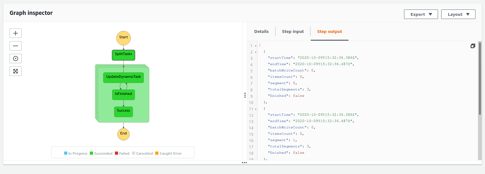

# Article akka-streams

Sources du projet ayant servi d'exemple pour l'article sur le blog FIXME.

Le projet consiste en 2 jobs
* le premier [DynamoInserter](src/main/scala/fr/glc/articles/akkastream/services/DynamoInserter.scala) permet de créer
des documents dans une table DynamoDB
* le deuxième [DynamoUpdater](src/main/scala/fr/glc/articles/akkastream/services/DynamoUpdater.scala) va scanner les 
documents d'une table DynamoDB et les mettre à jour en rajoutant un attribut "updatedAt" avec la date de mise à jour.
Il est prévu pour être lancé plusieurs fois en gardant un état d'avancement à passer entre chaque exécution afin de
ne pas être limité par le temps d'exécution maximum d'une fonction AWS Lambda qui est de 15 minutes.

# Dépendances

* JDK (testé avec JDK8)
* sbt
* NodeJs
* Yarn
* Un compte AWS avec des credentials configurés
* Une instance Izanami

# Fonctionnement

Le projet est fait pour être déployé dans des fonctions AWS Lambda mais dispose également d'un 
[Main](src/main/scala/fr/glc/articles/akkastream/Main.scala) qui permet de tester un peu le fonctionnement en local
(et qui pourrait tout fait être modifié pour fonctionner en CLI). 

# Stack

Les ressources AWS sont définies une stack [AWS CDK](https://docs.aws.amazon.com/cdk/latest/guide/home.html) qui permet 
de définir ses ressources AWS en Typescript (Infra As Code) et elles seront ensuite déployées par Cloudformation. La 
stack est définie [ici](src/main/cdk/lib/cdk-stack.ts).

Elle consiste en
* une table DynamoDB
* 3 lambdas
  * [Inserter](src/main/scala/fr/glc/articles/akkastream/lambda/InserterHandler.scala) qui insère des éléments dans le DynamoDB
  * [Updater](src/main/scala/fr/glc/articles/akkastream/lambda/UpdaterHandler.scala) qui fait les opérations d'update
  * [ListTasks](src/main/scala/fr/glc/articles/akkastream/lambda/ListTasks.scala) qui renvoie une liste de tâches permettant de
  gérer le nombre de lambdas en parrallèle pour la tâche d'Update (en tirant partie du mode 'Map' dans StepFunction)
* Une Stepfunction pour la tâche d'Update qui permet de la découper en plusieurs segments s'executant en parallèle

Schéma de la stepfunction

# Installation
* `yarn install`

# Déploiement
* `sbt assembly`
* `yarn cdk deploy --parameters vpcId=$vpcId --parameters subnetId1=$subnetId1 --parameters subnetId2=$subnetId2 --parameters subnetId3=$subnetId3 --parameters izanamiHost=$izanamiHost --parameters izanamiClientId=$izanamiClientId --parameters izanamiClientSecret=$izanamiClientSecret`
* `yarn cdk deploy` (pour les déploiements suivant, on a plus besoin de passer les paramètres)
